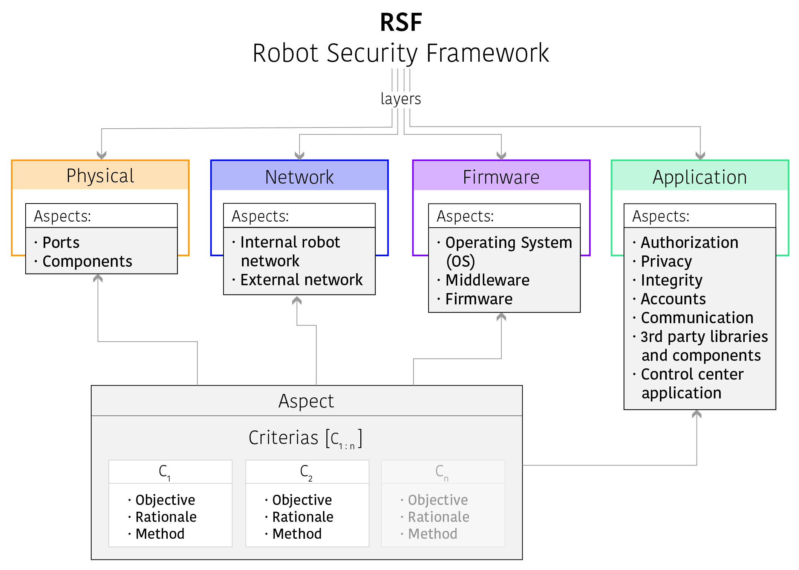

# The `Robot Security Framework` (RSF)
Robot Security Framework (RSF) is a standardized methodology to perform security assessments in robotics.

**Version**: 0.3

## How to cite our work
TODO: Vıctor Mayoral Vilches, Laura Alzola Kirschgens, Asier Bilbao Calvo, Alejandro Hernandez Cordero, Rodrigo Izquierdo Pisón, David Mayoral Vilches, Aday Muniz Rosas, Gorka Olalde Mendia, Lander Usategi San Juan, Irati Zamalloa Ugarte and Endika Gil-Uriarte. (2018) Introducing the Robot Security Framework (RSF), a standardized methodology to perform security assessments in robotics.

## Simplified `Markdown` template to execute the assessment

TODO: Compare to the last revision.

<!-- Layer 1 -->
<table>
  <tr>
    <th colspan="3"> 

### Physical layer
   </th>
  </tr>
  
  <!-- Aspect 1 -->
  <tr>
   <td>Aspect: <b>Ports</b></td>
   <td>
     
   <!-- Criteria 1 -->
   <table>
    <tr>
      <th colspan="2">Criteria: <b>Presence of external communication ports</b></th>
    </tr>
    <tr>
      <td>Objective</td>
      <td>Identify presence of unprotected external ports</td>
    </tr>
    <tr>
      <td>Rationale</td>
      <td>Unprotected external ports can let attackers in physical proximity to perform
        a variety of attacks and serve as an entry point for them</td>
    </tr>
    <tr>
      <td>Method</td>
      <td>
        
- Inspect documentation, consult developers and inspect robot’s body and components.
Look for accessible ports (e.g. Ethernet, USB, CAN, etc.)
- Open all doors, which are not protected by locks and look for ports inside</td>
    </tr>
   </table>

   <!-- Criteria 2 -->
   <table>
    <tr>
      <th colspan="2">Criteria: <b>Presence of internal communication ports</b></th>
    </tr>
    <tr>
      <td>Objective</td>
      <td>Identify presence of unprotected internal ports that typically correspond
with sensors, user interfaces, power or other robot-related components</td>
    </tr>
    <tr>
      <td>Rationale</td>
      <td>Unplugging robot components can potentially lead to the exposure of internal
communication ports. Often, these internal communication ports are typically
not protected in robots. This may allow attackers in physical proximity to
perform a variety of attacks and serve as an entry point</td>
    </tr>
    <tr>
      <td>Method</td>
      <td>
        
- Open all doors, which are not protected by locks, even those protected, and look
for robot components and their buses
- Investigate ventilation holes and see if they are wide enough to access internal
communication ports</td>
    </tr>
   </table>

   <!-- Criteria 3 -->
   <table>
    <tr>
      <th colspan="2">Criteria: <b>Security of external and internal communication ports</b></th>
    </tr>
    <tr>
      <td>Objective</td>
      <td>Verify if attackers can sniff or modify any critical data during communication
with a docking station or by connecting to the ports</td>
    </tr>
    <tr>
      <td>Rationale</td>
      <td>Unprotected external and internal ports can let attackers in physical proximity
to perform a variety of attacks and serve as an entry point for them</td>
    </tr>
    <tr>
      <td>Method</td>
      <td>
        
- Try to connect to the identified communication ports:
  - Determine if authentication is required(e.g. Network access control for Ethernet)?
  - Assess whether the communication is encripted
  - Try communicating with them, attempt fizzing to discover if robot’s state can
be affected.
- If a robot connects to a docking station to transfer some data, try to use sniffers
to see how data exchange is being done (verify if some sensitive, configuration or
control data is transferred in clear text)</td>
    </tr>
   </table>

   </td>
  </tr>
  
  <!-- Aspect 2 -->
  <tr>
   <td>Aspect: <b>Components</b></td>
   <td>
     
   <!-- Criteria 1 -->
   <table>
    <tr>
      <th colspan="2">Criteria: <b>Availability of components from outside</b></th>
    </tr>
    <tr>
      <td>Objective</td>
      <td>Identify internal hardware that is accessible from outside without a need</td>
    </tr>
    <tr>
      <td>Rationale</td>
      <td>Directly accessible components can be physically damaged, stolen, tampered,
removed or completely disabled causing the robot to misbehave. The most
obvious example is the removal of critical sensors for the behavior of the robot</td>
    </tr>
    <tr>
      <td>Method</td>
      <td>
        
- Inspect robots body and look for accessible components (e.g. sensors, actuators,
computation units, user interfaces, power components, etc.)
- Open all doors which are not protected by locks and look for accessible components
inside.</td>
    </tr>
    <tr>
      <td>Notes</td>
      <td>All cables should also remain inside of the robot. Some components require
to be partially outside of the body frame (e.g. certain sensors such as range finders, or
the antennas of certain wireless communication components) in such a case only the
        required part should stick out, but not the whole component</td>
    </tr>
   </table>

   <!-- Criteria 2 -->
   <table>
    <tr>
      <th colspan="2">Criteria: <b>Monitoring and alerting capabilities</b></th>
    </tr>
    <tr>
      <td>Objective</td>
      <td>Identify whether rogue access to the internal hardware of the robot can be
detected</td>
    </tr>
    <tr>
      <td>Rationale</td>
      <td>Having no verification whether the internals of the robot were accessed or
not means that attackers can easily tamper with any components or install a hardware
*trojan* unnoticed</td>
    </tr>
    <tr>
      <td>Method</td>
      <td>
        
- Identify all parts of the frame that can be opened or removed to get access to the
components or modules.
- Check whether there is an active (tamper switches) or passive (tamper evident
screws and seals) monitoring capability present.
- In case of active monitoring capability, verify that operator receives a real-time
alert and the incident is being logged and acted upon by reviewing procedures.</td>
    </tr>
    <tr>
      <td>Notes</td>
      <td>Passive monitoring provides information upon inspection whether internals
were accessed or not. However, there is still a time window between inspections when
        exploited robots can be abused</td>
    </tr>
   </table>

   <!-- Criteria 3 -->
   <table>
    <tr>
      <th colspan="2">Criteria: <b>Review logs of physical changes in the robot</b></th>
    </tr>
    <tr>
      <td>Objective</td>
      <td>Verify the logs of the robot and look for tampering actions. Log examples
include powering on/off events, connection/disconnection of physical components,
sensor values or actuator actions. Detect potential tampering based on this information</td>
    </tr>
    <tr>
      <td>Rationale</td>
      <td>Most robots register logs of a variety of events going from powering on/off
the robot to each individual component data. Specially, some robots detect physical changes on their components and register it. Such changes could lead to an undetected tampering of the system. Reviewing the logs could lead to discovering physical
tampering of the robot</td>
    </tr>
    <tr>
      <td>Method</td>
      <td>
        
- Review the logs of powering on and off routines of the robot.
- Review the logs of physical changes in the robot.
- Review the logs of each individual component and look for anomalies.</td>
    </tr>
   </table>

   </td>
  </tr>
</table>

<!-- Layer 2 -->
<table>
  <tr>
    <th colspan="3"> 

### Network layer
   </th>
  </tr>
  
  <!-- Aspect 1 -->
  <tr>
   <td>Aspect: <b>Internal robot network</b></td>
   <td>
     
   <!-- Criteria 1 -->
   <table>
    <tr>
      <th colspan="2">Criteria: <b>Network accessibility</b></th>
    </tr>
    <tr>
      <td>Objective</td>
      <td>Determine and assess network accessibility and the corresponding protection mechanisms.</td>
    </tr>
    <tr>
      <td>Rationale</td>
      <td>Internal networks could be pass</td>
    </tr>
    <tr>
      <td>Method</td>
      <td>
        
- Validate authentication mechanisms and verify that no known vulnerabilities are present on such.
- If internal network is password protected, attempt common password guessing.
- Verify whether the robot logs both successful and unsuccessful login attempts.</td>
    </tr>
   </table>

   <!-- Criteria 2 -->
   <table>
    <tr>
      <th colspan="2">Criteria: <b>Network fingerprinting</b></th>
    </tr>
    <tr>
      <td>Objective</td>
      <td>Mitigate the fingerprinting impact on the internal networks.</td>
    </tr>
    <tr>
      <td>Rationale</td>
      <td>
Network fingerprinting is useful to understand the internal network structure and its behavior, and to identify      components’ operating system by analyzing packets from that component. This information could be used for malicious purposes, since it provides fine-grained determination of an operating system and its characteristics.</td>
    </tr>
    <tr>
      <td>Method</td>
      <td>
        
- Perform fingerprinting attacks on the internal networks.
- Evaluate obtained information with the manufacturer’s available data and assessits impact.
- If necessary, propose a mitigation strategy through the use of ”scrubbers”, whichwill  ”normalize”  the  packets,  and  remove  the  unique  identifying  traits  that  the attacker is seeking. Refer to [18] for more details about the use of ”scrubbers”.</td>
    </tr>
   </table>

   <!-- Criteria 3 -->
   <table>
    <tr>
      <th colspan="2">Criteria: <b>Communication protocol security</b></th>
    </tr>
    <tr>
      <td>Objective</td>
      <td>Check if used communication protocol is up-to-date, secure and has noknown vulnerabilities.</td>
    </tr>
    <tr>
      <td>Rationale</td>
      <td>
Vulnerabilities in communication protocols can allow attackers to gain unauthorized access to the internal network of the robot and intercept or modify any transmitted data.</td>
    </tr>
    <tr>
      <td>Method</td>
      <td>
        
- Identify all present communication capabilities by inspecting documentation, byconsulting developers or by manual analysis.
- Analyze if used protocol versions provide encryption and mutual authentication.
- Verify that used protocol is hardened according to industry standards.</td>
    </tr>
   </table>

   <!-- Criteria 4 -->
   <table>
    <tr>
      <th colspan="2">Criteria: <b>Monitoring, alert and response capabilities</b></th>
    </tr>
    <tr>
      <td>Objective</td>
      <td>Identify whether internal network activity is monitored, alerts are issuedand corresponding actions are taken based on known signatures or anomalies.</td>
    </tr>
    <tr>
      <td>Rationale</td>
      <td>Proper security controls on the internal network might be challenging due
to hardware limitations or performance requirements, although it is critical for robots
to introspect, monitor, report and act on issues that could appear on their internal
networks. Security by obscurity is unfortunately a commonly accepted approach in
robotics, nevertheless, it has been demonstrated that this approach leads to critically
unsecured robots. Monitoring and control capabilities should be implemented on the
internal network of the robot either through the manufacturer or through additional
or external solutions. The decision of applying counter-measures to the attack or only
alerting should be determined by the impact of possible false positives on the operative
of the robot.</td>
    </tr>
    <tr>
      <td>Method</td>
      <td>
        
- Sweep the internal robot network and enumerate entry points (e.g. open ports, existing component information, network map of components, etc).
- Try to match the fingerprints identified and to map known vulnerabilities.
- Connect to the network and attempt to perform network-based attacks (e.g. ARPpoisoning, denial of service on a particular component, etc.)
- Verify whether the robot detects and registers incidents.
- Verify whether the robot acts upon such events and either:
 - (The robot) responds to insult proactively.
 - An operator receives a real time alert and acts based on procedures.</td>
    </tr>
   </table>
  
   <!-- Criteria 5 -->
   <table>
    <tr>
      <th colspan="2">Criteria: <b>Firewall</b></th>
    </tr>
    <tr>
      <td>Objective</td>
      <td>Identify whether internal network is separated from the external by thefirewall.</td>
    </tr>
    <tr>
      <td>Rationale</td>
      <td>Firewalls can help to further protect components, modules and communications
from the outside and ensure that they cannot accidentally leak data to the
external network.</td>
    </tr>
    <tr>
      <td>Method</td>
      <td>
        
- Inspect documentation, consult developers and inspect components which are responsible
for external communications. Identify that such components have firewalls.
- Inspect firewall settings and verify that no components or modules are allowed to
communicate to the external network unless it is necessary.
- If a VPN is used, verify that there are rules which allow components or modules
to communicate with the outside world only via the VPN tunnel.</td>
    </tr>
    <tr>
      <td>Notes</td>
      <td>There should be a firewall per each interface with external networks. That
means that each communication component interfacing with an external channel
should have a firewall behind it or use third party solutions. For example, WiFi
hotspots in robots or LTE/UMTS transceivers.</td>
    </tr>
   </table>
   </td>
  </tr>
  
  <!-- Aspect 2 -->
  <tr>
   <td>Aspect: <b>External network</b></td>
   <td>
     
   <!-- Criteria 1 -->
   <table>
    <tr>
      <th colspan="2">Criteria: <b>Availability of components from outside</b></th>
    </tr>
    <tr>
      <td>Objective</td>
      <td>Determine and assess network accessibility and the corresponding protection mechanisms.</td>
    </tr>
    <tr>
      <td>Rationale</td>
      <td>External networks could be password protected. If that is the case, the
corresponding mechanisms should be up to date and ensure that only authenticated
users are able to access the network.</td>
    </tr>
    <tr>
      <td>Method</td>
      <td>
        
- Validate authentication mechanisms and verify that no known vulnerabilities are
present on such.
- If external network is password protected, attempt common password guessing.
- Verify whether the robot logs the users connected to the network.</td>
    </tr>
   </table>

   <!-- Criteria 2 -->
   <table>
    <tr>
      <th colspan="2">Criteria: <b>Network fingerprinting</b></th>
    </tr>
    <tr>
      <td>Objective</td>
      <td>Mitigate the fingerprinting impact on the external networks.</td>
    </tr>
    <tr>
      <td>Rationale</td>
      <td>Network fingerprinting is useful to understand the network structure and
its behavior, as well as to identify devices’ operating system by analyzing packets
from that network. This information could be used for malicious purposes since it
provides fine-grained determination of an operating system and its characteristics.</td>
    </tr>
    <tr>
      <td>Method</td>
      <td>
        
- Perform fingerprinting attacks on the external network.
- Evaluate obtained information with the manufacturer’s available data and assess
its impact.
- If necessary, propose a mitigation strategy through the use of ”scrubbers”, which
will ”normalize” the packets, and remove the unique identifying traits that the
attacker is seeking. Refer to [18] for more details about the use of ”scrubbers”.</td>
    </tr>
   </table>

   <!-- Criteria 3 -->
   <table>
    <tr>
      <th colspan="2">Criteria: <b>Communication protocol security</b></th>
    </tr>
    <tr>
      <td>Objective</td>
      <td>Check if used communication protocol is up-to-date, secure and has no
known vulnerabilities.</td>
    </tr>
    <tr>
      <td>Rationale</td>
      <td>Vulnerabilities in communication protocols can allow attackers to gain
unauthorized access to the external network of the robot and intercept or modify any
transmitted data.</td>
    </tr>
    <tr>
      <td>Method</td>
      <td>
        
- Identify all communication capabilities being present by inspecting documentation,
consulting developers or by manual analysis.
- Analyze if used protocol versions provide encryption and mutual authentication.
- Verify that used protocol is hardened according to industry standards.</td>
    </tr>
    <tr>
      <td>Notes</td>
      <td>If providing encryption on the protocol level is not possible for some reasons,
VPN or application level encryption should be used.</td>
    </tr>
   </table>

   <!-- Criteria 4 -->
   <table>
    <tr>
      <th colspan="2">Criteria: <b>Network ports exposure</b></th>
    </tr>
    <tr>
      <td>Objective</td>
      <td>Identify whether only necessary network ports are exposed to the external
network.</td>
    </tr>
    <tr>
      <td>Rationale</td>
      <td>More open ports mean a bigger attack surface and therefore their number
should be as low as possible. Services that are exposed should have no known
vulnerabilities due to the ease of their exploitation.</td>
    </tr>
    <tr>
      <td>Method</td>
      <td>
        
- Connect to the network that is being used by the robot for communication and scan
all robot ports to find the open ones. Verify with manufacturer manuals whether
their presence is required.
- Identify, if possible, services running behind an open port and its version.
- Verify whether identified services are still receiving security updates and have no
known vulnerabilities.</td>
    </tr>
   </table>
    
   <!-- Criteria 5 -->
   <table>
    <tr>
      <th colspan="2">Criteria: <b>Monitoring, alert and response capabilities</b></th>
    </tr>
    <tr>
      <td>Objective</td>
      <td>Identify whether the external network activity is being monitored, alerts
are issued based on known signatures or anomalies and appropriate actions are taken.</td>
    </tr>
    <tr>
      <td>Rationale</td>
      <td>Properly configured external network monitoring can spot network based
attacks in their inception even if other security mechanisms are compromised.</td>
    </tr>
    <tr>
      <td>Method</td>
      <td>
        
- Sweep the external robot network and enumerate entry points (e.g. open ports,
protocol information, network map of components, robot components etc).
- Try to match the fingerprints identified and map to known vulnerabilities.
- Perform network based attacks (e.g. ARP poisoning, denial of service on a particular
component).
- Verify whether the robot detects and registers incidents on the external network.
- Verify whether the robot acts upon such events and either:
 - (The robot) responds to insult proactively.
 - An operator receives a real time alert and acts based on procedures.</td>
    </tr>
    <tr>
      <td>Notes</td>
      <td>In those cases where it is not possible to implement external robot network
monitoring, alerting and response due to limitations on the robot capabilities, manufacturers
should extend their capabilities or refer to third party solutions that could
offer such.</td>
    </tr>
   </table>

   </td>
  </tr>
</table>

<!-- Layer 3 -->
<table>
  <tr>
    <th colspan="3"> 

### Firmware layer
   </th>
  </tr>
  
  <!-- Aspect 1 -->
  <tr>
   <td>Aspect: <b>Operating System (OS)</b></td>
   <td>
     
   <!-- Criteria 1 -->
   <table>
    <tr>
      <th colspan="2">Criteria: <b>Underlying OS updates</b></th>
    </tr>
    <tr>
      <td>Objective</td>
      <td>Verify that the used Operating System (OS) is still supported by the manufacturer
and there is a mechanism to perform system updates.</td>
    </tr>
    <tr>
      <td>Rationale</td>
      <td>Outdated operating systems can have security vulnerabilities.</td>
    </tr>
    <tr>
      <td>Method</td>
      <td>
        
- Check if the underlying OS is still maintained and receives security patches.
- Check whether the latest security updates are applied.
- Check if there is an update mechanism present and enabled.
- Check if the updates are encrypted when transferred to the robot.</td>
    </tr>
   </table>

   </td>
  </tr>
   
  <!-- Aspect 2 -->
  <tr>
   <td>Aspect: <b>Middleware</b></td>
   <td>
   
   <!-- Criteria 1 -->
   <table>
    <tr>
      <th colspan="2">Criteria: <b>Verify code compliance (if accessible)</b></th>
    </tr>
    <tr>
      <td>Objective</td>
      <td>In those cases where it applies (white box assessment), ensure compliance
of middleware code against established compliance mechanisms. A common middleware
such as ROS 2 should comply with the Motor Industry Software Reliability
Association (MISRA) guidelines. Other middlewares might use different guidelines.</td>
    </tr>
    <tr>
      <td>Rationale</td>
      <td>As robotics and autonomy grow, especially in certain fields of robotics,
users of middlewares need to be able to determine if the software is able to be used in
a safety-critical environment. With suitable guidance and modification, it is expected
that middleware code could be integrated as part of certain compliant system. For this
purpose, code should be developed and reviewed following certain guidelines. The
most common one is the Motor Industry Software Reliability Association (MISRA),
widely used in many safety-critical environments and adopted by the ROS 2 middleware.</td>
    </tr>
    <tr>
      <td>Method</td>
      <td>
        
- Determine the exact set of guidelines that are being applied.
- Validate whether these guidelines have been implemented.</td>
    </tr>
   </table>

   <!-- Criteria 2 -->
   <table>
    <tr>
      <th colspan="2">Criteria: <b>Middleware updates</b></th>
    </tr>
    <tr>
      <td>Objective</td>
      <td>Verify that the used middleware is still maintained and supported by the
manufacturer. Verify to perform system updates in the middlware.</td>
    </tr>
    <tr>
      <td>Rationale</td>
      <td>Outdated middlewares in robotics are subject to have security vulnerabilities.
This is specially true with ROS, ROS 2 and other robot-related middlewares</td>
    </tr>
    <tr>
      <td>Method</td>
      <td>
        
- Check if the underlying middleware is still maintained and receives security
patches.
- Check whether the latest security updates are applied.
- Check if there is an update mechanism present and enabled.
- Check if the updates are encrypted when transferred to the robot.</td>
    </tr>
   </table>

  </td>
  </tr>
   
  <!-- Aspect 3 -->
  <tr>
   <td>Aspect: <b>Firmware</b></td>
   <td>
   <!-- Criteria 1 -->
   <table>
    <tr>
      <th colspan="2">Criteria: <b>Firmware updates</b></th>
    </tr>
    <tr>
      <td>Objective</td>
      <td>Check if manufacturer firmware can be securely updated.</td>
    </tr>
    <tr>
      <td>Rationale</td>
      <td>If new vulnerabilities are discovered it is important to ensure that there is a
way to provide updates to all the devices that are already sold to customers. However,
update mechanisms can be circumvented by an attacker to deliver malicious update.
Therefore, it is important to verify the origin of the update prior to installation.</td>
    </tr>
    <tr>
      <td>Method</td>
      <td>
        
- Identify if there is a mechanism to deliver firmware updates.
- Verify that updates are cryptographically signed.
- Verify that the signature is verified prior to installation.</td>
    </tr>
   </table>
   </td>
  </tr>
</table>

<!-- Layer 4 -->
<table>
  <tr>
    <th colspan="3"> 

### Application layer
   </th>
  </tr>
  
  <!-- Aspect 1 -->
  <tr>
   <td>Aspect: <b>Authorization</b></td>
   <td>
     
   <!-- Criteria 1 -->
   <table>
    <tr>
      <th colspan="2">Criteria: <b>Access control</b></th>
    </tr>
    <tr>
      <td>Objective</td>
      <td>Verify that resources are accessible only to authorized users or services.</td>
    </tr>
    <tr>
      <td>Rationale</td>
      <td>Access to the restricted functions by anonymous users or users with lower
access control rights diminishes all the benefits of access control.</td>
    </tr>
    <tr>
      <td>Method</td>
      <td>
        
- Log in with authorized credentials and attempt to perform different actions, record
the requests that are being made.
- Log out and attempt to send the same requests as an unauthenticated user. Verify
whether it is successful.
- Log out and log in again as a user with lower access rights. Attempt to send the
same requests again. Verify whether it is successful.</td>
    </tr>
   </table>
   </td>
  </tr>
   
  <!-- Aspect 2 -->
  <tr>
   <td>Aspect: <b>Privacy</b></td>
   <td>
   
   <!-- Criteria 1 -->
   <table>
    <tr>
      <th colspan="2">Criteria: <b>Privacy assessment</b></th>
    </tr>
    <tr>
      <td>Objective</td>
      <td>Identify whether the robot is compliant to the privacy policies that apply.</td>
    </tr>
    <tr>
      <td>Rationale</td>
      <td>Not complying with privacy standards could result in a breach of personal
data.</td>
    </tr>
    <tr>
      <td>Method</td>
      <td>
        
- Verify that minimum Personally Identifiable Information (PII) is collected and
transmitted over the internet.
- Verify that if PII is collected users are made aware of it (e.g. in case of a video
recording people can be warned by stickers or signs on the robot).
- Verify that all PII is stored and transmitted in a secure manner.</td>
    </tr>
   </table>

   <!-- Criteria 2 -->
   <table>
    <tr>
      <th colspan="2">Criteria: <b>Data protection</b></th>
    </tr>
    <tr>
      <td>Objective</td>
      <td>Identify whether the robot manufacturer emplaces mechanisms to ensure
compliance to the data protection regulations and laws that apply. Particularly, General
Data Protection Regulation (GDPR) in the EU.</td>
    </tr>
    <tr>
      <td>Rationale</td>
      <td>Not complying with regulations could result in penalties.</td>
    </tr>
    <tr>
      <td>Method</td>
      <td>
        
- Assess the legitimate interests.
- Assess the consent.
- Assess the information provisions.
- Assess the third party data.
- Assess the profiling.
- Assess the legacy data</td>
    </tr>
    <tr>
      <td>Method</td>
      <td>It is not relevant to the security of the robot itself. However not complying
with data protection regulations can result in financial penalties and should therefore
be taken into consideration.</td>
    </tr>
   </table>
  </td>
  </tr>
   
  <!-- Aspect 3 -->
  <tr>
   <td>Aspect: <b>Integrity</b></td>
   <td>
   <!-- Criteria 1 -->
   <table>
    <tr>
      <th colspan="2">Criteria: <b>Integrity check</b></th>
    </tr>
    <tr>
      <td>Objective</td>
      <td>Identify whether the system performs an integrity check of critical components
and takes action if they are not present or modified.</td>
    </tr>
    <tr>
      <td>Rationale</td>
      <td>Tampering with any of the critical components can make the robot cause
physical damage to people and property.</td>
    </tr>
    <tr>
      <td>Method</td>
      <td>
        
- Consult documentation and developers to find whether integrity check for critical
components is present.
- Try disabling or modifying critical components (e.g. safety sensors or range finding
systems) of the robot and check if the operator receives a real-time alert and
the incident is being logged.
- Check whether the robot continues to function afterwards. Its operation should
be stopped as soon as any critical component is disabled or modified, (e.g. if a
proximity sensor is disabled the robot should not be able to move, because it will
not be able to spot obstacles and can easily do some physical damage).</td>
    </tr>
    <tr>
     <td>Note</td>
     <td>Critical components are those that can directly influence the robot’s operation,
       functionality or safety.</td>
    </td>
   </table>
   </td>
  </tr>
  
  <!-- Aspect 4 -->
  <tr>
   <td>Aspect: <b>Accounts</b></td>
   <td>
   <!-- Criteria 1 -->
   <table>
    <tr>
      <th colspan="2">Criteria: <b>Default passwords</b></th>
    </tr>
    <tr>
      <td>Objective</td>
      <td>Identify presence of default passwords.</td>
    </tr>
    <tr>
      <td>Rationale</td>
      <td>Default passwords are easily accessible online and remain the most popular
and effortless way to exploit internet connected devices.</td>
    </tr>
    <tr>
      <td>Method</td>
      <td>
        
- Review documentation and consult developers to identify whether default passwords
are used.
- Attempt to log in with commonly used passwords.
- If default passwords are used, verify whether their change is encouraged on the
first use.
- If unique passwords are created on a per device basis, ensure that they are random
and not in a sequential order.</td>
    </tr>
    <tr>
     <td>Note</td>
     <td>When trying commonly used passwords, beware of account lockouts and verify
       that there is a recovery mechanism present.</td>
    </tr>
   </table>
   
   <!-- Criteria 2 -->
   <table>
    <tr>
      <th colspan="2">Criteria: <b>Password complexity</b></th>
    </tr>
    <tr>
      <td>Objective</td>
      <td>Verify that password complexity is enforced.</td>
    </tr>
    <tr>
      <td>Rationale</td>
      <td>Weak passwords may take little time to guess.</td>
    </tr>
    <tr>
     <td>Method</td>
     <td>Attempt to change the password to a weak one and verify whether this
change succeeded.</td>
    </tr>
    <tr>
      <td>Note</td>
      <td>Password complexity requirements depend on the sensitivity of the application.
In general, the minimum requirements that should be in place are:
        
- A password length of, at least, 8 characters.
- Enforce the usage of 3 of this 4 categories:lower-case, upper-case, numbers, special
characters.</td>
    </tr>
   </table>
   
   <!-- Criteria 3 -->
   <table>
    <tr>
      <th colspan="2">Criteria: <b>Login Lockout</b></th>
    </tr>
    <tr>
      <td>Objective</td>
      <td>Identify whether the login lockout is present.</td>
    </tr>
    <tr>
      <td>Rationale</td>
      <td>Having strong and non-default passwords may not be enough. Brute force
attempts should be prevented by implementing a login lockout mechanism.</td>
    </tr>
    <tr>
      <td>Method</td>
      <td>Attempt to log in with incorrect credentials multiple times. Verify that the
account has got a lockout.</td>
    </tr>
    <tr>
     <td>Note</td>
     <td>The lockout threshold depends on the sensitivity of the service. In general, there
should be 5 login attempts or less. Prior to testing, verify that the lockout recovery
mechanism is being present. Accounts can be either locked out for a specific duration
of time and/or they can be recovered by physical interaction with the robot.</td>
    </tr>
   </table>
   
   <!-- Criteria 4 -->
   <table>
    <tr>
      <th colspan="2">Criteria: <b>Hardcoded or backdoor accounts</b></th>
    </tr>
    <tr>
      <td>Objective</td>
      <td>Identify presence of hardcoded or backdoor accounts.</td>
    </tr>
    <tr>
      <td>Rationale</td>
      <td>Hardcoded or backdoor credentials pose the same danger as default passwords.
However, their identification is usually harder due to the need for reverse
engineering or possession of the source code.</td>
    </tr>
    <tr>
      <td>Method</td>
      <td>
        
- Consult documentation and developers to identify whether hardcoded or backdoor
credentials are used.
- Analyze the source code for hardcoded or backdoor credentials.</td>
    </tr>
   </table>
   
   <!-- Criteria 5 -->
   <table>
    <tr>
      <th colspan="2">Criteria: <b>Cleartext passwords</b></th>
    </tr>
    <tr>
      <td>Objective</td>
      <td>Identify whether passwords are stored in cleartext.</td>
    </tr>
    <tr>
      <td>Rationale</td>
      <td>Cleartext passwords can be leveraged by an attacker for privilege escalation
or lateral movement.</td>
    </tr>
    <tr>
      <td>Method</td>
      <td>
        
- Review the source code and documentation, consult developers and identify
whether passwords are stored in a cleartext.</td>
    </tr>
    <tr>
      <td>Note</td>
      <td>Lockout threshold depends on the sensitivity of the service. In general, there
should be 5 login attempts or less.</td>
    </tr>
   </table>
   </td>
  </tr>
  
  <!-- Aspect 5 -->
  <tr>
   <td>Aspect: <b>Communication</b></td>
   <td>
   <!-- Criteria 1 -->
   <table>
    <tr>
      <th colspan="2">Criteria: <b>Encryption</b></th>
    </tr>
    <tr>
      <td>Objective</td>
      <td>Ensure that all sensitive data is transmitted over an encrypted channel.</td>
    </tr>
    <tr>
      <td>Rationale</td>
      <td>If data is transmitted in a clear text attackers can easily gather sensitive
information (e.g. credentials, audio and video streams, private data).</td>
    </tr>
    <tr>
      <td>Method</td>
      <td>
        
- Intercept connection between a robot and a control center application or a cloud
server.
- Use protocol analyzer to verify that transmitted data is encrypted.</td>
    </tr>
   </table>
   
   <!-- Criteria 2 -->
   <table>
    <tr>
      <th colspan="2">Criteria: <b>Replay protection</b></th>
    </tr>
    <tr>
      <td>Objective</td>
      <td>Ensure that transmitted data cannot be replayed.</td>
    </tr>
    <tr>
      <td>Rationale</td>
      <td>If replay protection is absent, attackers can record legitimate packets and
then arbitrary replay them to achieve desired actions.</td>
    </tr>
    <tr>
      <td>Method</td>
      <td>
        
- Intercept the connection between the robot and a control center application or a
cloud server.
- Record the control or configuration packets sent to the robot.
- Attempt to replay the packets and verify whether the desired action is executed.</td>
    </tr>
   </table>
   </td>
  </tr>
  
  <!-- Aspect 6 -->
  <tr>
   <td>Aspect: <b>3rd party libraries and components</b></td>
   <td>
   <!-- Criteria 1 -->
   <table>
    <tr>
      <th colspan="2">Criteria: <b>Vulnerabilities</b></th>
    </tr>
    <tr>
      <td>Objective</td>
      <td>Verify that 3rd party software components do not have known vulnerabilities.</td>
    </tr>
    <tr>
      <td>Rationale</td>
      <td>It is quite common to blindly rely on 3rd party components. However they
can easily introduce a vulnerability into the product where they are used.</td>
    </tr>
    <tr>
      <td>Method</td>
      <td>
        
- Identify which 3rd party libraries and components are used and what are their
versions.
- Look for known vulnerabilities in the current version.
- Verify whether the identified component is still receiving security updates and has
no unpatched vulnerabilities.
- Verify that the latest security updates are installed.</td>
    </tr>
   </table>
   </td>
  </tr>
  
  <!-- Aspect 7 -->
  <tr>
   <td>Aspect: <b>Control center application</b></td>
   <td>
   <!-- Criteria 1 -->
   <table>
    <tr>
      <th colspan="2">Criteria: <b>Web application</b></th>
    </tr>
    <tr>
      <td>Objective</td>
      <td>Perform a security assessment of the web application.</td>
    </tr>
    <tr>
      <td>Rationale</td>
      <td>The robot can be indirectly compromised if the attacker exploits a web
control center application.</td>
    </tr>
    <tr>
      <td>Method</td>
      <td>
        
- Identify web interface that is being used (hosted on the robot itself or a cloud
server).
- Use OWASP methodology to test web application against OWASP Top 10 Web
application vulnerabilities.</td>
    </tr>
   </table>
   
   <!-- Criteria 2 -->
   <table>
    <tr>
      <th colspan="2">Criteria: <b>Mobile application</b></th>
    </tr>
    <tr>
      <td>Objective</td>
      <td>Perform a security assessment of the mobile application.</td>
    </tr>
    <tr>
      <td>Rationale</td>
      <td>The robot can be indirectly compromised if the attacker exploits a mobile
phone control center application.</td>
    </tr>
    <tr>
      <td>Method</td>
      <td>
        
- Identify whether the robot has a mobile app that can be used to control or interact
with it.
- Test the application against OWASP Mobile Top 10.</td>
    </tr>
   </table>
   </td>
  </tr>
</table>

## License
GPLv3.

## Glossary
- **component**: a part of something that is discrete and identifiable with respect to combining with other parts to produce something larger (*source: ISO/IEC 24765*).
  - *Note 1 to entry*: Component can be either software or hardware. Even a component that is mainly software or hardware can be referred to as a software or hardware component respectively.
- **module**: component with special characteristics to facilitate system design, integration, interoperability, re-use.  
- **interoperability**: the capability to communicate and transfer data among modules and combine modules physically in a manner that requires the user to have little or no knowledge of the unique characteristics of those modules.
- **firmware**: (in the context of robotics) software that is embedded in robots.
